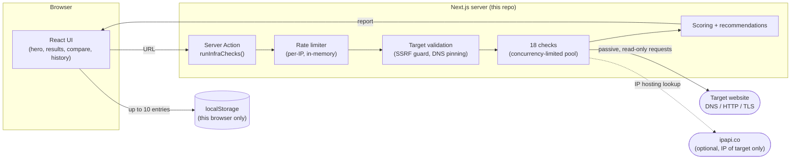

# InfraLens — Developer Documentation

InfraLens is Randy Code's open-source website inspection tool: give it a
URL, it runs 18 passive, read-only checks server-side and returns a scored,
readable report — no exploitation, no brute force, no port scanning, no
crawling beyond the page itself.

This document is **developer/maintainer documentation** — implementation,
architecture, and how to work on the code. For the product story (why it
was built, engineering decisions, migration), see the case study at
[`/projects/infralens`](https://randy-code.dev/projects/infralens). For
end-user documentation (how to use it, what results mean), see
[`/tools/infralens/docs`](https://randy-code.dev/tools/infralens/docs) and
[`/tools/infralens/privacy`](https://randy-code.dev/tools/infralens/privacy).

InfraLens lives natively inside this repository (`app/tools/infralens/`,
`src/infralens/`) — it isn't a separate deployment or a proxied app. It
started as a standalone product; that history is preserved in
[`CHANGELOG.md`](CHANGELOG.md) (frozen at the point of migration).

## Purpose

Give a fast, honest read on a site's public technical posture — DNS, TLS,
HTTP security headers, infrastructure, structure, metadata, and performance
signals — without requiring an account, storing anything server-side, or
doing anything a normal visitor's browser and DNS resolver couldn't
already do.

## Architecture



Nothing about a specific analysis is persisted server-side — the report
goes straight back to the browser, and the only thing that outlives the
request is the local history in the browser's own `localStorage`.

### Core principles

- **Server Actions only** — every check runs server-side (CORS makes most
  of this impossible from the browser anyway, and running it client-side
  would leak the visitor's own IP to every site analyzed).
- **SSRF-guarded** — target resolution is validated and pinned before any
  check runs; private/loopback/link-local ranges and DNS-rebinding attempts
  are rejected.
- **Modular checks** — each check is an independent, typed module
  implementing a shared interface.
- **Ephemeral by design** — no accounts, no server-side analysis storage,
  capped local history only.

### Namespacing

InfraLens's code is isolated under `src/infralens/` (not `src/`) with
dedicated path aliases (`@infralens`, `@infralens-lib`, `@infralens-config`,
`@infralens-components`, `@infralens-hooks` — see `tsconfig.json` and
`vitest.config.ts`) so it can't accidentally collide with the rest of the
portfolio's code. Its Tailwind classes are scoped under `.infralens-scope`
in `app/globals.css`, which inherits Randy Code's design tokens and
overrides only what's intentionally distinct (InfraLens's green primary/
ring accent).

## Project structure

```
app/tools/infralens/
├── page.tsx                  # Landing + analysis
├── compare/page.tsx          # Local report comparator
├── docs/page.tsx             # End-user documentation
├── privacy/page.tsx          # What's sent, stored, and contacted
├── layout.tsx, not-found.tsx, opengraph-image.tsx
├── [...slug]/page.tsx        # Catch-all → styled 404 (no basePath to route it automatically)
└── actions/run-checks.ts     # Server action: rate limit → validate → run checks

src/infralens/
├── lib/
│   ├── checks/
│   │   ├── run-checks.ts             # Orchestration (concurrency pool, timeouts)
│   │   ├── calculate-score.ts        # Scoring
│   │   ├── export.ts / export-markdown.ts
│   │   └── checks/                   # The 18 individual check modules
│   ├── dns/                          # Resolver + cache
│   ├── security/                     # SSRF guard, target validation, TLS inspection
│   ├── compare/                      # Report diffing + Markdown export
│   ├── history/                      # Local history storage (versioned format)
│   ├── recommendations/
│   ├── concurrency.ts, rate-limit.ts
├── hooks/use-analysis-history.ts
├── config/{constants,env,site-config}.ts
└── components/
    ├── landing/                      # hero, cta, results-preview, open-source, what-it-checks
    ├── results/                      # report header, category sections, filters, ...
    ├── compare/compare-client.tsx
    └── history/history-section.tsx

public/infralens/                     # Namespaced brand assets and fonts
```

## What InfraLens analyzes

18 checks across 6 weighted categories:

| Category            | Weight | Checks                                                                                                                             |
| ------------------- | ------ | ---------------------------------------------------------------------------------------------------------------------------------- |
| HTTP & Security     | 25     | Security headers (value-checked, not just presence), HTTPS/TLS enforcement + redirect downgrade detection, security.txt (RFC 9116) |
| Network & DNS       | 20     | DNS records (A/AAAA/CNAME/MX/TXT/NS/CAA), DNS security (SPF/DMARC/DKIM/DNSSEC), IP/ASN/hosting (via ipapi.co)                      |
| Infrastructure      | 20     | WAF/CDN header-fingerprint detection (always probabilistic, informational)                                                         |
| Website Structure   | 15     | robots.txt, sitemap discovery, internal/external link reachability                                                                 |
| Metadata & Stack    | 10     | HTML metadata, Open Graph/Twitter tags, stack detection (confidence-graded), server header leak detection, accessibility hints     |
| Performance Signals | 10     | Response time/size/compression/Cache-Control, reachability snapshot                                                                |

Port scanning, traceroute, and any active/intrusive technique are
intentionally excluded — see [Limitations](#limitations) and
[`SECURITY.md`](SECURITY.md).

## Security model

Every outbound request to a user-supplied target goes through
`src/infralens/lib/security/`:

1. **URL normalization** — strict protocol (`http`/`https` only),
   credentials, and port allowlist (`src/infralens/config/constants.ts`).
2. **DNS resolution + IP classification** — private, loopback, link-local,
   cloud-metadata, and other non-public ranges blocked for both IPv4 and
   IPv6, including alternate notations.
3. **Pinned connection** — the resolved IP is pinned for the actual
   request, closing the gap between DNS validation and the real network
   connection (DNS-rebinding protection).
4. **Redirects followed manually**, each hop independently revalidated
   through the same pipeline — a redirect can never reach a target the
   initial validation wouldn't have allowed on its own.

Response bodies are capped while streaming (`MAX_RESPONSE_BYTES`, 2 MB);
every check has its own timeout that shrinks to fit the remaining
analysis-wide deadline (`ANALYSIS_TIMEOUT_MS`, 20s) as the analysis
progresses; checks run through a bounded concurrency pool
(`MAX_CONCURRENT_CHECKS`, 6) instead of unbounded `Promise.all`.

Rate limiting is in-memory, per-IP, 1 request/30s — sufficient for a
single-instance deployment, not yet a hard guarantee under horizontal
scaling. See [`SECURITY.md`](SECURITY.md) for how to report a
vulnerability.

## DNS and TLS

- DNS resolution uses Node's native `dns/promises`, with an in-memory TTL
  cache (`src/infralens/lib/dns/`) to avoid redundant lookups within an
  analysis.
- TLS inspection (`src/infralens/lib/security/inspect-tls.ts`) performs a
  raw handshake to report the negotiated protocol version, certificate
  issuer, expiration, and validity — surfaced as a failure if invalid, a
  warning if expiring within 30 days.
- DNSSEC is reported as `not-evaluated` — Node's built-in resolver has no
  DS/DNSKEY/RRSIG support.

## Scoring

Each category has a fixed weight (table above, sums to 100). Within a
category:

- **pass** — 100% of its share of the category weight
- **warning** — 60%
- **fail** — 0%
- **info / unavailable / error** — excluded entirely, never counted for or
  against the score

The 0–100 score maps to a letter grade (A–E), worded deliberately as a
visual aid ("Strong configuration signals" … "Major public configuration
issues detected") rather than a certification. The report's "Why this
score?" panel shows the live breakdown for that specific analysis.

## Local history and comparison

- **History** (`src/infralens/lib/history/`) — the last 10 analyses,
  versioned in `localStorage`; a missing or mismatched schema version is
  treated as incompatible and reset cleanly rather than risking a
  half-parsed shape reaching the UI. Never sent to a server.
- **Compare** (`/tools/infralens/compare`, `src/infralens/lib/compare/`) —
  import two exported JSON reports, see score/category deltas and every
  check that improved, regressed, or changed, and export the diff as
  Markdown. Entirely client-side.
- **Export** — JSON or Markdown, from `src/infralens/lib/checks/export.ts`
  and `export-markdown.ts`. Structural validation
  (`validate-export.ts`) rejects malformed files and refuses reports from
  an incompatible major schema version instead of silently comparing them.

## Environment variables

Everything is optional — InfraLens runs with zero configuration.

```bash
# .env.local

# Optional: raises the IP/ASN lookup limit via ipapi.co (1,000 free req/day without a key)
IPAPI_KEY=

# Optional: canonical URL override, only needed if deploying somewhere
# other than randy-code.dev
NEXT_PUBLIC_SITE_URL=
```

Validated once at module load (`src/infralens/config/env.ts`) — consumers
read the parsed `env` object instead of `process.env` directly.

## Development

InfraLens uses the same toolchain as the rest of the repository — see the
root [`README.md`](../../README.md) for setup. InfraLens-specific commands:

```bash
pnpm dev             # http://localhost:3000/tools/infralens
pnpm test            # unit tests (includes InfraLens's ~260 tests)
pnpm e2e:infralens    # Playwright E2E (rate-limited flow — runs single-worker)
```

`pnpm e2e:infralens` starts its own server and runs against real DNS/
network (deliberately not mocked), including one real analysis against
`example.com` — see [`CONTRIBUTING.md`](CONTRIBUTING.md).

## Limitations

- **Read-only** — passive analysis only, no exploitation, no intrusive
  scanning, no modification of the target.
- **Heuristic where it matters** — stack and WAF/CDN detection are
  confidence-graded, never presented as certain, and never affect the
  score.
- **Single snapshot** — reachability and performance checks represent one
  point in time, not historical monitoring.
- **Indicators, not guarantees** — results are a starting point for
  investigation, not a security certification.
- Only run analyses on sites you're authorized to inspect — the target
  sees InfraLens's requests in its own logs, same as any other visitor.

## License

InfraLens is **MIT licensed**, scoped to this directory —
[`LICENSE`](LICENSE). This does not extend to the rest of the Randy Code
repository, which has no repository-wide open-source license (see the root
[`README.md`](../../README.md#licensing)).
