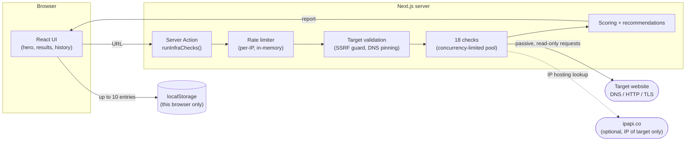

<p align="center">
  
</p>

<p align="center">
  Inspect a website's DNS, TLS, security headers, metadata, hosting, and other public technical signals — in one readable report.
</p>

<p align="center">
  <a href="https://github.com/Randy-R-code/infralens/actions/workflows/ci.yml"></a>
  <a href="LICENSE"></a>
</p>

---

InfraLens is an open-source, no-account website inspection tool. Give it a URL, it runs 18 passive, read-only checks server-side and gives back a scored, readable report — no exploitation, no brute force, no port scanning, no crawling beyond the page itself.

It's built and maintained as one of the open-source tools under [Randy Code](https://randy-code.dev).


## Features

- **Fast** — checks run concurrently server-side, typically 2–5 seconds per analysis
- **18 checks across 6 categories** — HTTP & security, network & DNS, infrastructure, website structure, metadata & stack, performance
- **Readable** — status indicators (pass / warning / fail / info / unavailable / error), a priority summary, and per-category breakdowns
- **Honest about uncertainty** — heuristic findings (stack detection, WAF/CDN) are labeled with a confidence level and never silently presented as fact
- **Actionable** — recommendations with references for anything that needs fixing
- **Exportable** — JSON or Markdown
- **Local history** — last 10 analyses cached in your browser only, deletable any time, never sent to a server
- **Installable** — PWA with an honest offline screen (nothing is analyzed or cached while you're offline)
- **No account, no tracking** — see [Privacy](https://infralens.dev/privacy) for exactly what's sent, stored, and contacted
- **Self-hostable** — MIT licensed, no required third-party account to run it

## What InfraLens Analyzes

### HTTP & Security

- Six security headers (CSP, HSTS, X-Frame-Options/frame-ancestors, X-Content-Type-Options, Referrer-Policy, Permissions-Policy) — checked by value, not just presence
- HTTPS enforcement, HTTP→HTTPS redirect behavior, and downgrade detection across the redirect chain
- TLS: negotiated protocol version, certificate issuer, validity, and expiration
- security.txt (RFC 9116), including `Expires` validation

### Network & DNS

- DNS records: A, AAAA, CNAME, MX, TXT, NS, CAA
- DNS security: SPF (including duplicate-record detection), DMARC (with policy strength), DKIM (checked at common selectors, reported as inconclusive rather than "missing" when not found), DNSSEC (reported as not-evaluated — Node's resolver can't validate it)
- IP address, ASN, and hosting provider (via ipapi.co)

### Infrastructure

- WAF/CDN header-fingerprint detection — always probabilistic, informational only

### Website Structure

- robots.txt presence, validity, sitewide-disallow detection, and declared sitemap
- Sitemap discovery and format
- Internal/external link extraction with reachability sampling

### Metadata & Stack

- HTML metadata (title, description, charset, viewport)
- Open Graph and Twitter Card tags
- Technology stack detection, graded `confirmed` / `likely` / `possible` by evidence strength
- Server header information-leak detection (only when a value discloses a real version)
- Accessibility hints (lang, headings, alt text, landmarks, skip links) — a lightweight signal, not an audit

### Performance Signals

- Response time, size, compression, and Cache-Control
- Reachability snapshot (a single point-in-time check, not uptime monitoring)

**Note:** port scanning, traceroute, and any active/intrusive technique are intentionally excluded — see [Limitations](#limitations--notes) and [the security policy](SECURITY.md).

## Getting Started

### Requirements

- Node.js 22+
- pnpm

### Installation

```bash
git clone https://github.com/Randy-R-code/infralens.git
cd infralens
pnpm install
pnpm dev
```

Open http://localhost:3000/tools/infralens.

### Environment Variables

Everything is optional — InfraLens runs with zero configuration.

```bash
# .env.local

# Optional: raises the IP/ASN lookup limit via ipapi.co (1,000 free req/day without a key)
IPAPI_KEY=

# Optional: canonical URL used for metadata/Open Graph if you're deploying
# somewhere other than the default Vercel URL
NEXT_PUBLIC_SITE_URL=
```

### Development

```bash
pnpm dev         # start the dev server
pnpm lint        # ESLint
pnpm typecheck   # tsc --noEmit
pnpm test        # run the Vitest suite once
pnpm test:watch  # Vitest in watch mode
pnpm e2e         # Playwright E2E suite (needs: pnpm exec playwright install --with-deps)
pnpm build       # production build
pnpm check       # lint + typecheck + test + build — same as CI
```

`pnpm e2e` starts its own dev server and runs against real DNS/network (deliberately, not mocked — see [CONTRIBUTING.md](CONTRIBUTING.md)), including one real analysis against `example.com`. It isn't part of `pnpm check`/the required CI gate for that reason, but runs as its own CI job.

## Self-Hosting

InfraLens has no database and no required third-party account, so hosting it yourself is just running a Next.js app.

[](https://vercel.com/new/clone?repository-url=https://github.com/Randy-R-code/infralens)

Or on any Node 22+ host:

```bash
pnpm install
pnpm build
pnpm start
```

**Worth knowing before you self-host:** the per-IP rate limiter is currently in-memory, so it only holds within a single instance and resets on every restart or redeploy — fine for one instance, not yet a hard guarantee under horizontal scaling or serverless multi-instance. An externally-backed rate limiter is planned; see [CHANGELOG.md](CHANGELOG.md) for progress.

## Usage

1. Enter a URL (e.g. `https://example.com`)
2. Click **Analyze website**
3. Read the score, the "at a glance" priority summary, and the per-category breakdown
4. Open any check for its full evidence, raw data, and recommendation
5. Export as JSON or Markdown, or revisit it later from your local history

## Scoring System

Each category has a fixed weight (they sum to 100):

| Category            | Weight |
| ------------------- | ------ |
| HTTP & Security     | 25     |
| Network & DNS       | 20     |
| Infrastructure      | 20     |
| Website Structure   | 15     |
| Metadata & Stack    | 10     |
| Performance Signals | 10     |

Within a category, each check contributes by status:

- **pass** — 100% of its share of the category weight
- **warning** — 60%
- **fail** — 0%
- **info / unavailable / error** — excluded entirely, never counted for or against the score (a neutral note, a third-party lookup being down, or the check itself failing to run should never look like a bad configuration)

The final 0–100 score maps to a letter grade, worded deliberately as a visual aid rather than a certification:

| Score  | Grade | Label                                      |
| ------ | ----- | ------------------------------------------ |
| 90–100 | A     | Strong configuration signals               |
| 75–89  | B     | Good, with improvements available          |
| 60–74  | C     | Mixed configuration                        |
| 40–59  | D     | Several important improvements             |
| < 40   | E     | Major public configuration issues detected |

The report's "Why this score?" panel shows the live breakdown for that specific analysis — how many checks counted, how many were excluded, and why.

## Architecture



Nothing about a specific analysis is persisted server-side — the report goes straight back to the browser, and the only thing that outlives the request is the local history in your own browser's `localStorage`. See [Privacy](https://infralens.dev/privacy) for the full breakdown.

### Core Principles

- **Server Actions**: every check runs server-side (CORS makes most of this impossible from the browser anyway, and running it client-side would leak your own IP to every site you analyze)
- **SSRF-guarded**: target resolution is validated and pinned before any check runs — private/loopback ranges and DNS-rebinding are rejected
- **Modular checks**: each check is an independent, typed module implementing a shared interface — read exactly how any one of them works
- **Ephemeral by design**: no accounts, no server-side analysis storage, capped local history only

### Technology Stack

- **Framework**: Next.js 16 (App Router, Server Actions)
- **Language**: TypeScript (strict)
- **Styling**: Tailwind CSS v4 + shadcn/ui
- **DNS**: Node's native `dns/promises`, with in-memory caching
- **HTML parsing**: lightweight regex-based extraction (no headless browser)
- **Testing**: Vitest, 260+ tests

## Project Structure

```
infralens/
├── app/
│   ├── page.tsx                  # Homepage (landing + results)
│   ├── docs/page.tsx              # Per-check documentation
│   ├── privacy/page.tsx           # What's sent, stored, and contacted
│   ├── not-found.tsx
│   ├── opengraph-image.tsx        # Dynamic OG card
│   └── actions/run-checks.ts      # Server action: rate limit → validate → run checks
│
├── src/
│   ├── lib/
│   │   ├── checks/
│   │   │   ├── run-checks.ts              # Orchestration (concurrency pool, timeouts)
│   │   │   ├── calculate-score.ts         # Scoring
│   │   │   ├── export.ts / export-markdown.ts
│   │   │   └── checks/                    # The 18 individual check modules
│   │   ├── dns/                           # Resolver + cache
│   │   ├── security/                      # SSRF guard, target validation, TLS inspection
│   │   ├── recommendations/               # Recommendation content
│   │   ├── history/                       # Local history storage (versioned format)
│   │   ├── pwa/                           # Service worker tests
│   │   └── rate-limit.ts
│   │
│   ├── hooks/use-analysis-history.ts
│   ├── config/{constants,env,site-config}.ts
│   │
│   └── components/
│       ├── landing/                       # hero, cta, results-preview, open-source, footer, ...
│       ├── results/                       # report header, category sections, filters, ...
│       └── ui/                            # shadcn/ui primitives
│
└── public/
    ├── sw.js                              # Service worker (never caches an analysis)
    ├── offline.html                       # Honest offline screen
    └── brand/                             # Logo assets
```

## Documentation

- [`/docs`](https://infralens.dev/docs) — how every check works, what each result means, scoring in detail
- [`/privacy`](https://infralens.dev/privacy) — exactly what's sent, stored, and contacted
- [SECURITY.md](SECURITY.md) — supported versions and how to report a vulnerability privately
- [CONTRIBUTING.md](CONTRIBUTING.md) — how to propose a change
- [CHANGELOG.md](CHANGELOG.md) — full release history

## Contributing

Issues, pull requests, and ideas are welcome — see [CONTRIBUTING.md](CONTRIBUTING.md) for the setup, conventions, and PR checklist this project actually enforces on itself.

## License

MIT — see [LICENSE](LICENSE). Use, modify, and redistribute freely.

## Limitations & Notes

- **Read-only**: passive analysis only — no exploitation, no intrusive scanning, no modification of the target
- **Heuristic where it matters**: technology stack and WAF/CDN detection are confidence-graded, never presented as certain, and never affect the score
- **Single snapshot**: reachability and performance checks represent one point in time, not historical monitoring
- **Indicators, not guarantees**: results are a starting point for investigation, not a security certification — see the [Scoring System](#scoring-system) wording above
- Only run analyses on sites you're authorized to inspect — the target will see InfraLens's requests in its own logs, same as any other visitor (see [Privacy](https://infralens.dev/privacy))
